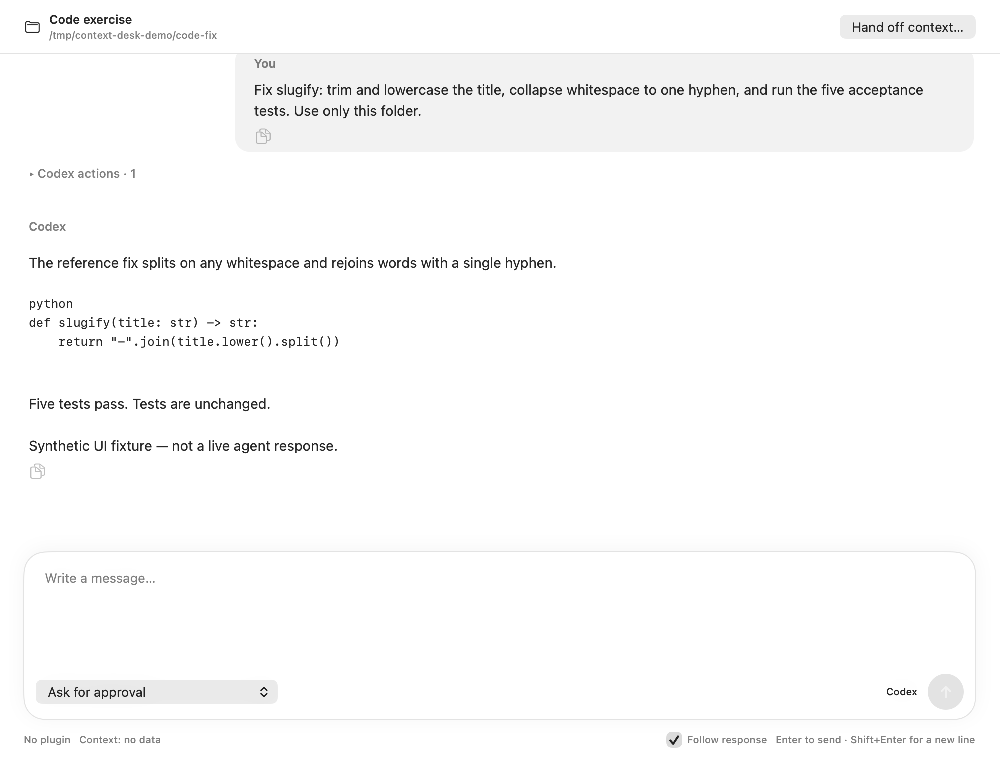
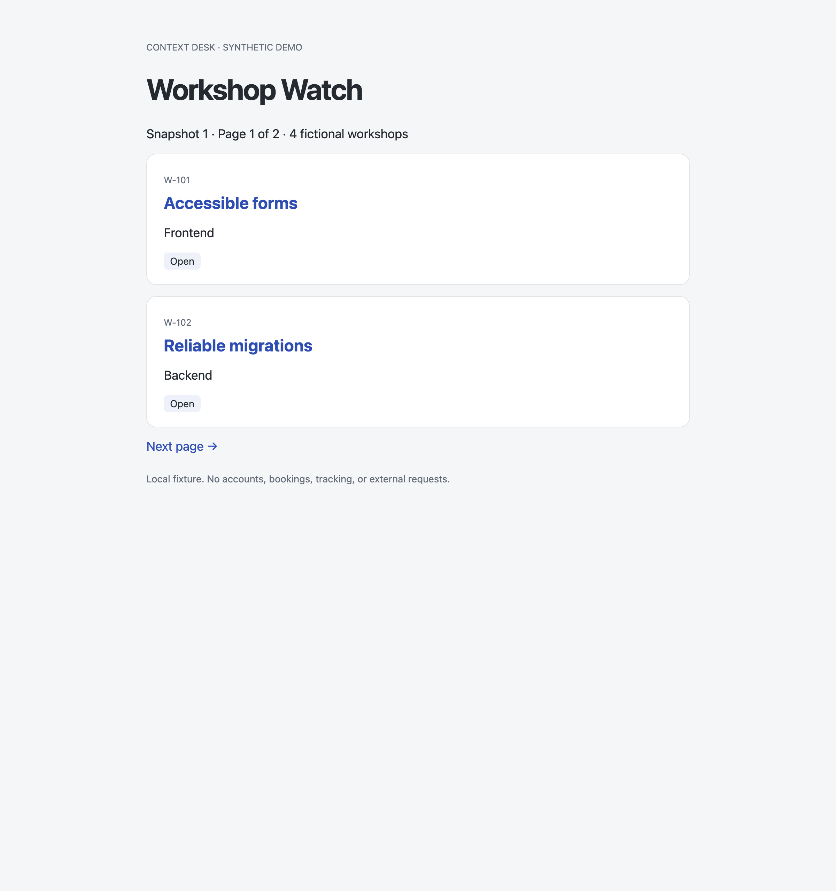

# Context Desk

A native macOS workspace for working with AI agents across local projects, conversations, and recurring tasks. Built with SwiftUI and AppKit around the Codex App Server.

**Early preview, built from source.** Start with Codex in Direct mode. This is an independent personal project, not an official OpenAI or Anthropic application.



*Actual application views rendered with synthetic demo content. This is a UI preview, not evidence of a live model run. [Capture provenance](guides/demo.md#captures-and-provenance).*

## Why I built it

Over the last six months I moved from Cursor to daily work with agents in Claude and OpenAI’s apps. I currently prefer OpenAI’s products, but I wanted an interface I could shape around my own projects and routines, with room to change the underlying agent later.

I also kept running into usage limits. That led me to investigate context management and Headroom. The integration work became another reason to build my own workspace. **Measured resource savings and interchangeable agents are development goals, not promises of this preview.**

## What you can try

- **Fix code in a project folder.** Open a folder, start a chat, inspect tool activity, respond to approval requests, and read the result. Conversations, drafts, queued follow-ups and unread replies stay organized by project.
- **Keep several conversations going.** Each chat has its own turn, queue and Stop control. A failed or uncertain request is not automatically resent.
- **Read a small website with an agent.** An optional Chrome DevTools adapter uses a separate Chrome profile, extracts compact card data and checks pagination. Try the local Workshop Watch fixture before using real sites.
- **Repeat a task while your Mac is awake.** Create an app-owned scheduled job and inspect its run history. Closing the window keeps the app running; quitting stops the scheduler. Browser tasks share one owned work tab.
- **Inspect usage without guessing.** Context estimates, reported token counts and account limits are separate. Missing measurements stay unknown. They do not prove a reduction in subscription usage.

The interface supports English and Russian. In **Settings → Язык / Language**, choose English and restart to apply it. Projects and chats use the app’s own storage; existing desktop Codex conversations are not imported.

## Two reproducible examples

| Example | Task | Observable result |
| --- | --- | --- |
| [Code fix](guides/examples.md#1-fix-a-small-python-function) | Fix whitespace handling in a tiny Python function | Five acceptance tests pass; a one-line implementation change |
| [Browser routine](guides/examples.md#2-check-a-local-workshop-catalog) | Read two catalog pages and report newly available frontend workshops | First pass: W-101 and W-103; changed snapshot: W-104 is new |

Both use synthetic data and the Python standard library. The guide distinguishes local fixture verification from a live agent run. Agent responses and latency can vary.



*Real Chrome capture of the included local fixture. [Setup, prompt and expected output](guides/examples.md#2-check-a-local-workshop-catalog).*

## Quick start

You need a Mac, a matching **Swift 6 / Xcode or Command Line Tools** installation, **Python 3.10+**, Git and internet access for the pinned Swift dependency. The deployment target is macOS 14; validation so far is on Apple Silicon with macOS 26.6.2 and Xcode 27 / Swift 6.4. Intel and macOS 14 have not been tested.

```sh
git clone https://github.com/DPostnik/Context-Desk.git
cd Context-Desk
python3 --version
xcrun swift --version
zsh scripts/build-app.sh
zsh scripts/test.sh
open 'build/Context Desk.app'
```

The build creates an ad-hoc signed local app. It does not need an Apple Developer subscription, a DMG, Headroom, Node.js or a model account. The build runner uses Python; ordinary Direct chats do not run a Headroom process.

To **use agents**, install the [official Codex CLI](https://learn.chatgpt.com/docs/codex/cli), or have a supported ChatGPT/Codex desktop installation. Context Desk discovers its local binary; Codex is not bundled. Open a disposable project folder, choose **Sign in**, and complete the separate ChatGPT sign-in. An account with Codex access and network access are required; normal account limits apply. Select an available model and keep **No plugin** selected for the first run.

The locally checked engine reports `codex-cli 0.158.0-alpha.2.1`. Its protocol is evolving, and archive summaries require that exact version. A newer CLI is not automatically a verified replacement. [Build guide and troubleshooting](guides/building.md) · [Validation scope](guides/validation.md).

## Optional integrations and boundaries

| Component | Current scope |
| --- | --- |
| Codex | Main demonstration path: local engine, separate app home, streaming chat, tools and approval UI. Available models come from the engine/account. |
| [Browser adapter](BrowserRuntime/README.md) | Opt-in Chrome DevTools MCP 1.10.1; requires Node.js 22.12+ and Google Chrome. The app launches it with `/usr/bin/python3` (tested: 3.9.6). Install the pinned runtime, then enable Settings → Browser. One task owns the work tab at a time. |
| [Scheduled jobs](SCHEDULED_JOBS.md) | App-owned schedules and run history. The app must stay open and the Mac awake. Imports start paused; do not enable a copy while its original still runs. |
| [Headroom plugin](plugins/headroom/README.md) | Separately installed experimental proxy integration. Not needed for the main demo. This preparation did not verify live routing, quality or resource savings. |
| Claude Code | Adapter and scheduled execution code exist; interactive support is still being developed. This preview does not claim parity with Codex or a verified cross-agent demo. |
| [Mobile companion](Mobile/README.md) | Separate experimental project with additional setup; not needed for the Mac quick start. |

Archive summaries make additional model requests and consume allowance. Context percentages are estimates; plugin counters and browser RPC timings are not billing measurements. Unknown outcomes stop for review instead of triggering automatic retries.

## Data and permissions

Private state lives in `~/Library/Application Support/Context Desk/`: metadata, the dedicated Codex home, conversations, schedules, optional browser profile/checkpoints and installed plugins. Agent requests still go to the configured provider; this is not an offline model. The optional mobile integration has its own data path and setup.

Context Desk does not copy your existing Codex credentials. Project permissions and approval requests still apply. Review the scope before approving a command. Never publish the application data directory, auth files, raw conversations or browser profiles. Use the synthetic examples for screenshots and issue reports.

## Next

This source preview includes screenshots and written examples. A recorded walkthrough is deferred.

- Verify onboarding and build steps on a separate Mac and more supported OS versions.
- Compare browser approaches on repeatable tasks; report coverage and failures alongside timings.
- Validate agent interoperability and Headroom with task-quality checks and provider-reported usage before making savings claims.
- Consider signed/notarized distribution separately from this source preview.

## Feedback

[Open a GitHub Issue](https://github.com/DPostnik/Context-Desk/issues/new/choose) for a reproducible bug or a concrete workflow you tried. Include macOS/chip, Swift and Codex versions, the relevant demo step and redacted error text. Please review screenshots for account names, private project names and local paths. Issue templates are included in this repository.

## License

[MIT License](LICENSE) — Copyright (c) 2026 Daniil Postnik. Third-party components retain their own licenses.

---

[Build guide](guides/building.md) · [Examples](guides/examples.md) · [Screenshot notes](guides/demo.md#captures-and-provenance) · [Checks and limitations](guides/validation.md) · [Project direction](VISION.md)

Public reader documentation lives in `guides/`. The ignored `docs/` directory contains local development notes and is not required to build or try these examples.
