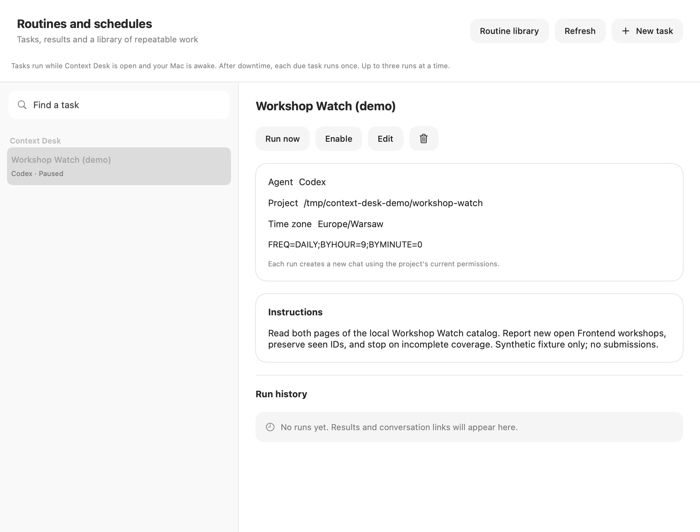

# Deferred walkthrough and capture notes

**Deferred by the author on 2026-09-28.** The first public showing will use the source repository, build instructions, screenshots and written examples. Live demo rehearsals and video recording are outside the current preparation scope. The shot list below is retained for later; it is not a prerequisite for this source preview. No video file is included.

Window capture was attempted from this environment with macOS `screencapture -l` on an isolated test window and failed with `could not create image from window`. AppKit rendering of the production content panels works. The running personal app was not restarted or used as a recording surface. Recording is not claimed complete.

## Prepare one safe take

1. Build the app using [the source instructions](building.md). Finish existing work before restarting it.
2. Use English, No plugin, Codex and a model actually available to your account. Copy the [code exercise](examples.md#1-fix-a-small-python-function) to a disposable folder. Keep Ask for approval.
3. Close or hide unrelated windows and private project lists. Record only the application/fixture windows; keep sign-in, account quota dialogs, notifications, file pickers and private paths out of frame. Disable notification banners for the take using the OS controls if needed.
4. Verify the baseline shows two expected failures. Start with a new chat. Keep the exact prompt from the example ready.
5. Do one rehearsal. Review its files and tests. Reset by making another fresh copy for the recorded take, not by rewriting a real project.

## Shot list (80 seconds)

| Time | Screen and action | Spoken point |
| --- | --- | --- |
| 0–8 s | Context Desk open on the disposable code project; show the app name | A native Mac workspace shaped around everyday agent work |
| 8–20 s | Show the tiny function and the two failing tests, then the example prompt in the composer | One specific, reproducible task, with acceptance tests |
| 20–32 s | Send the prompt; show tool activity and inspect an approval if one occurs | The agent works in the selected project; requests remain visible |
| 32–47 s | Show the changed function and final test result; rerun the tests in a terminal scoped to the demo folder | Five passing tests are the evidence, not the final chat sentence |
| 47–57 s | Show the context label and No plugin route without opening account details | Context estimates are separate from account limits; no savings claim |
| 57–70 s | Switch to the local Workshop Watch page, then a paused demo task's schedule view | The next example is a repeating browser check; the app must stay open and the Mac awake |
| 70–80 s | Show the repository README quick start and Issues link | Build from source, try the examples, report a concrete problem |

Model duration is variable. Record the whole run; if it exceeds the timing, cut the wait with an explicit **“Waiting time shortened”** caption. Do not speed up actions and imply that the edited duration is measured agent latency. Show an approval only if the real run requests one. Do not fabricate progress, token counts or a completed scheduled run.

## Suggested English narration

> I built Context Desk because I wanted a Mac workspace I could shape around my everyday work with agents.
>
> Here is a small example: this Python function fails two whitespace tests. I open its folder, ask Codex to fix it, and keep the existing tests as the acceptance criteria.
>
> I can follow the tool activity and review requests for permission. Once the agent finishes, I inspect the change and rerun the tests. All five pass.
>
> The app also shows context estimates and the active request route. These are visibility tools; I am not claiming lower subscription usage.
>
> Another example checks a local workshop catalog through a separate Chrome profile. Tasks can run on a schedule while Context Desk is open and the Mac is awake.
>
> This is an early source preview. The repository includes build instructions and both examples. If you try it, I would like to hear what worked and where you got stuck through GitHub Issues.

Use the “all five pass” sentence only after the recorded run passes them. If the browser routine has not been run through the app, describe its schedule as configured, not demonstrated end to end.

## Captures and provenance

| Asset | How it was made | What it proves |
| --- | --- | --- |
| [Code panel](../media/code-workspace.png) | Production `ChatView`, rendered by AppKit with a synthetic task and reference answer | Appearance of the actual chat panel; not live Codex output |
| [Schedule panel](../media/scheduled-task.png) | Production `JobsView`, rendered with a paused synthetic definition and no run history | Appearance of the actual task UI; no schedule was enabled or run |
| [Browser catalog](../media/browser-catalog.png) | Chrome DevTools screenshot of the loopback fixture using an isolated temporary profile | Real browser rendering of the included page |
| [Browser results](../media/browser-check.json) | Production browser adapter reads and verifies both pages across three passes | Coverage, expected matching/new IDs; no model or scheduler run |



The UI captures deliberately omit the outer navigation sidebar: its compositor surface was incomplete in an AppKit bitmap capture. These are production panels, not fabricated interface mockups. Synthetic `/tmp/context-desk-demo/…` paths and the `Demo fixture` label are deliberate; no user's home directory, email, credentials, private history or actual account metrics are embedded. The capture harness never calls app boot, sign-in or scheduler startup.

To reproduce the still images after reading the scripts:

```sh
zsh scripts/capture-demo.sh
python3 scripts/check-demo-browser.py
```

The first command builds/runs the offline suite, then runs only the opt-in native media harness. The second needs the pinned browser runtime already installed. Review every new capture before publication; do not assume a previous privacy review covers a new file.

The first planned article can use the code panel and the personal motivation in README. The browser article can use the local fixture and its explicit coverage evidence. This task did not repeat comparisons with other browser tools, measure model tokens or validate Headroom savings.
